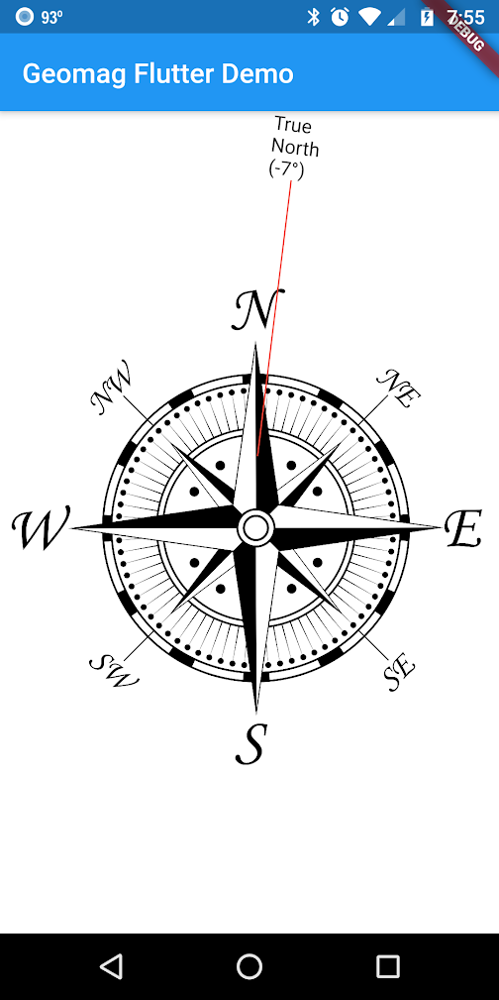

# geomag

Translate GPS location data to geo-magnetic data such as magnetic declination.

The difference between true north and magnetic north is called magnetic declination.
It is different everywhere on Earth and even changes over time.
Every five years or so, a couple of governing bodies release coefficients data for
calculating the magnetic declination at a given lat/lng and time.

[GeoMag] takes data from the World Magnetic Model Coefficients, [WmmCof],
to initialize. You can provide your own or use the bundled data, WMM-2015v2
from 09/18/2018. Use [calculate()] to process GPS coordinates into a
[GeoMagResult].

See http://www.ngdc.noaa.gov/geomag/WMM/DoDWMM.shtml and
https://www.ngdc.noaa.gov/geomag/WMM/wmm_rdownload.shtml.

This is a port of the geomagJS package,
https://github.com/cmweiss/geomagJS.

> Adapted from the geomagc software and World Magnetic Model of the NOAA
> Satellite and Information Service, National Geophysical Data Center.

